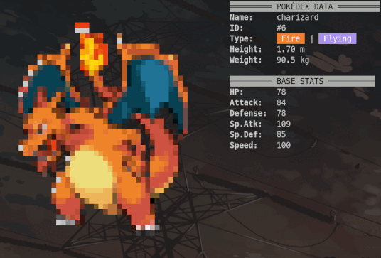

# Pokédex CLI
A retro-style command-line Pokédex powered by the PokéAPI where you can explore locations, catch, and inspect Pokémon in your terminal.


## 📟 Inspect Preview

<p align="center">
  
</p>
<p align="center"><it>🌟 Some of your favorites 🌟</it></p>


## ⚙ Setup Instructions

1. Clone the repository:
```bash
git clone https://github.com/fotis-sofoulis/pokedex-cli.git && cd pokedex-cli/
```

2. Make sure you have Go 1.18+:
```bash
go version
```

3. Install dependencies:
```bash
go mod tidy
```

4. Build the binary and run:
```bash
go build -o pokedex-cli && ./pokedex-cli
```

5. Quick run (no binary build):
```bash
go run .
```

## ▶️ Get Started

Type `help` inside the REPL to see available commands.

## 📋 ToDo

1. Add more detailed Pokémon stats
2. Support for shiny Pokémon variants and forms
3. Implement search/filter functionality for pokemon and locations
